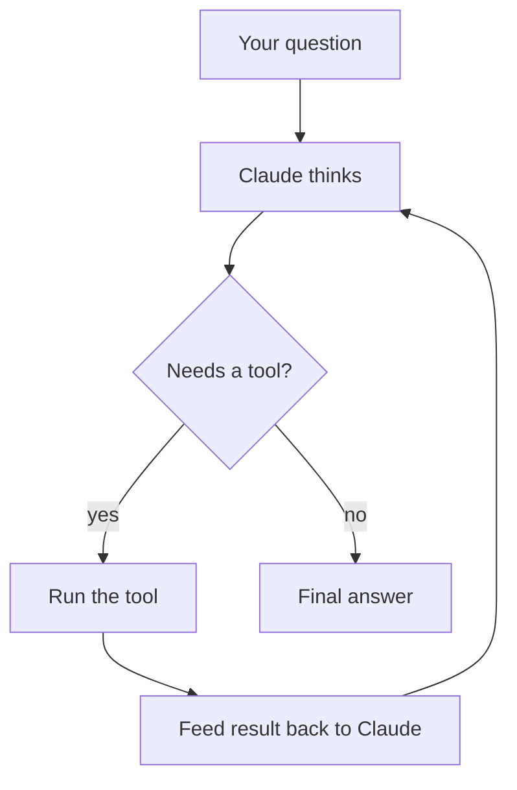
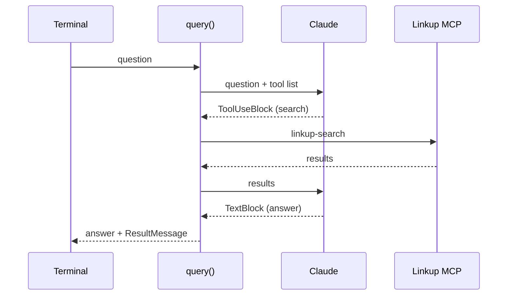

# Step 01 — One-shot CLI research agent

Your first agent: ask a question at the command line, and Claude searches the live web before
answering.

This is the 0 → 1 step, so it goes slowly and explains everything. Later steps assume what is
covered here. It is part of a hands-on preparation track for the **Anthropic Claude Certified
Architect – Foundations** exam (CCAR-F); §8 maps this step to the exam objectives it covers.

**Audience.** You know Python and have called an LLM API before. You do *not* need prior experience
with the Agent SDK, MCP, or agentic loops — those are introduced from scratch below.

---

## 1. What you'll build

```console
$ uv run python research_agent.py "what is the latest released version of uv?"
⚠ claude.ai connectors are disabled because ANTHROPIC_API_KEY or another auth source is set
[mcp: linkup connected]
[calling tool: mcp__linkup__linkup-search]
The latest released version of the uv Python package manager is 0.12.1...

--- success · $0.0286 ---
```

Four things happened there, and each is a concept worth naming:

1. Claude **decided on its own** that it could not answer from memory and needed to search.
2. It **called a tool** it did not implement — [Linkup](https://app.linkup.so), a hosted web-search
   service (free tier; you'll create a key in §3.3), reached over a protocol called MCP.
3. It **read the result and wrote a final answer**, then the run ended and printed its real cost.
4. The script told you the search service **connected** before any of that — so a missing answer
   can never be silently confused with a broken tool.

Nobody wrote "if the question is about current events, call search." That decision is the agent's.

> The `⚠ claude.ai connectors` line is expected, not an error — §3.2 explains it.

---

## 2. Concepts, before the code

### 2.1 An API call vs. an agent

A normal LLM API call is one round trip: you send text, you get text back. If the model needs
information it does not have, too bad — it answers anyway, or tells you it can't.

An **agent** adds a loop. The model can reply with *"call this tool with these arguments"* instead
of a final answer. Something runs the tool, feeds the result back, and asks the model to continue.
That repeats until the model produces an answer instead of another tool request.



That loop is the whole idea behind "agentic." The important part for this step: **the SDK runs
that loop for you.** If you called the raw Claude API yourself, you would have to inspect
`stop_reason`, execute the tool, append the result to the conversation, and re-send it — by hand,
every iteration. Here, `query()` does it.

### 2.2 How the SDK actually runs (this explains a lot)

`claude-agent-sdk` is a Python package, but it is **not** a plain HTTP client. It launches the
**Claude Code CLI as a subprocess** and talks to it. The Python objects you will see are a
friendly interface over that process.

Read that twice, because it silently explains three things that otherwise look arbitrary:

- the SDK can **read configuration files off your disk**, so where you run it from matters;
- an option called `cwd` (working directory) affects an agent that never touches files;
- the `claude.ai connectors are disabled` warning comes from the CLI, not from your Python.

Nearly every surprise in §6 traces back to this one fact.

> The SDK bundles a copy of the CLI, so most readers need nothing extra. If you ever see
> `CLINotFoundError`, install Node and then `npm install -g @anthropic-ai/claude-code`.

### 2.3 Tools

A **tool** is a function Claude can ask to have called: it has a name, a description, and a schema
for its arguments. Claude never runs code itself — it emits a request, and your side executes it.

| Source | What it is | Used here? |
|---|---|---|
| **Built-in** | Tools the SDK ships with — `Read`, `Write`, `Bash`, `Grep`, `WebSearch`, … | No, deliberately off |
| **MCP server** | Tools provided by a separate program or service (below) | **Yes** — Linkup's web search |
| **Custom / in-process** | Python functions you expose with the `@tool` decorator | Not yet — a later step |

### 2.4 MCP, in one paragraph

**MCP (Model Context Protocol)** is an open standard for exposing tools to an AI agent. Rather
than every app inventing its own plugin format, a service publishes an MCP server, and any
MCP-aware client can use its tools. It is deliberately boring plumbing: a server advertises
*"here are my tools, here are their schemas,"* and the client calls them.

An MCP server can be a **local process** the SDK launches (stdio), a **remote HTTP endpoint**, or
**in-process code** in your own app. This step uses the remote HTTP kind, because Linkup hosts one
— which means we write no search code at all.

Docs: [MCP with the Agent SDK](https://code.claude.com/docs/en/agent-sdk/mcp) ·
[MCP standard](https://modelcontextprotocol.io/docs/getting-started/intro)

**Tool naming.** Every MCP tool is addressed as `mcp__<server-name>__<tool-name>` — two
underscores in each gap. The server name is whatever key *you* chose in your config, so here the
Linkup server is named `linkup` and its search tool is `mcp__linkup__linkup-search`.

### 2.5 Permission

Claude seeing a tool and Claude being *allowed to call it* are two different things. By default an
MCP tool call pauses for approval — which in a non-interactive script means it hangs or fails.
`allowed_tools` is the list you pre-approve.

Docs: [Permissions](https://code.claude.com/docs/en/agent-sdk/permissions)

---

## 3. Setup

### 3.1 Clone, install uv, install dependencies

```bash
git clone https://github.com/VXC-Systems/Claude_Agent_SDK_Tutorial.git
cd Claude_Agent_SDK_Tutorial

# install uv if you don't have it
curl -LsSf https://astral.sh/uv/install.sh | sh          # macOS / Linux
# Windows PowerShell: irm https://astral.sh/uv/install.ps1 | iex
# or, any platform with pipx: pipx install uv

uv sync
```

[uv](https://docs.astral.sh/uv/) is a fast Python package manager that creates and manages the
virtual environment for you. `uv sync` reads `pyproject.toml`, **downloads the right Python
version if you don't have it** (this project needs 3.14+), and installs the dependencies into
`.venv/`. You never activate anything by hand — `uv run` does it implicitly.

### 3.2 Your Anthropic API key

The Agent SDK talks to Claude over Anthropic's API, which requires a key you pay for.

1. Create an account at [platform.claude.com](https://platform.claude.com/) and add credit.
2. Create an API key. It looks like `sk-ant-api03-...`.
3. Put it in your `.env` (created in §3.4).

**The SDK does not read `.env` files by itself.** It reads the `ANTHROPIC_API_KEY` *environment
variable*. [`python-dotenv`](https://pypi.org/project/python-dotenv/)'s `load_dotenv()` is what
copies the file's contents into the environment — which is why the script calls it explicitly.

Two things worth knowing early:

- **Cost is per run and visible.** Runs in this step cost roughly **1–4 US cents** on Haiku. The
  script prints the exact figure, which is a good habit to keep.
- **An API key overrides a Claude.ai login.** The CLI underneath (§2.2) can authenticate either
  from a Claude.ai subscription or from an explicit API key, and the key wins. That is the whole
  meaning of the `⚠ claude.ai connectors are disabled` line — harmless here.

### 3.3 Your Linkup key

[Linkup](https://app.linkup.so) is a web-search API. We use it because it hosts a ready-made MCP
server, so the agent gains real web search without us writing an integration.

Sign up at [app.linkup.so](https://app.linkup.so) and copy your API key. Check their current
pricing page for what the free tier includes and whether it covers the hosted MCP endpoint — that
has changed before and this tutorial is not the authority on it.

### 3.4 Where the `.env` goes

**In the project root — the folder holding `pyproject.toml`.** Not in the step folder, and not in
your home directory:

```
Claude_Agent_SDK_Tutorial/
├── .env              ←  create this (git-ignored)
├── .env.example         copy this to make it
├── .gitignore
├── pyproject.toml
└── research-agent/
    └── 01-one-shot/
        └── research_agent.py
```

```bash
cp .env.example .env
```

Then edit `.env` and fill in both keys. It is listed in `.gitignore`, so it will not be committed
— but never paste a real key into a README, an issue, or a chat window either.

If a key is missing, the script exits with a message naming the file to create rather than a
stack trace.

### 3.5 Verify your setup

```bash
cd research-agent/01-one-shot
uv run python research_agent.py "Search the web for today's date."
```

You want to see **`[mcp: linkup connected]`**. That line is the setup check: it reports the search
server's connection status before Claude does anything. `failed` or `needs-auth` there means your
Linkup key is wrong — which is otherwise indistinguishable from Claude simply choosing not to
search.

---

## 4. The code, line by line

The whole script is ~100 lines. Here is every part of it.

### 4.1 Imports, and why everything is `async`

```python
import asyncio
import os
import sys
import tempfile
from pathlib import Path

from dotenv import load_dotenv

from claude_agent_sdk import (
    AssistantMessage, ClaudeAgentOptions, ResultMessage,
    SystemMessage, TextBlock, ToolUseBlock, query,
)
```

The SDK's API is **asynchronous**. That is not decoration: an agent run is a stream of events over
time (Claude thinking, a tool being called, a result arriving), and `async` is how Python models
"a sequence of things that arrive later." In practice it costs you three keywords — `async def`,
`async for`, and `asyncio.run()` at the bottom to start the event loop.

### 4.2 Loading credentials

```python
PROJECT_ROOT = Path(__file__).resolve().parents[2]

load_dotenv(PROJECT_ROOT / ".env")   # the documented path — use this one
load_dotenv()                        # any .env above the current directory
# The author keeps keys under ~/.config; delete this line unless you do too.
load_dotenv(Path.home() / ".config" / "linkup" / "linkup.env")
```

`parents[2]` walks up from this file (`01-one-shot` → `research-agent` → project root), so the
`.env` is found no matter which directory you run from.

`load_dotenv()` **never overwrites a variable that is already set**, so the first source to define
a key wins, and the later calls are optional fallbacks — skipped silently when the file does not
exist. The bare `load_dotenv()` searches upward from the current directory. The third line is the
author's own habit of keeping keys under `~/.config/`; nothing creates that file for you, so delete
the line unless you keep keys there too.

```python
def require_env(name: str) -> str:
    value = os.environ.get(name)
    if not value:
        sys.exit(f"Missing {name}.\nCopy .env.example to .env in {PROJECT_ROOT} and add your key.")
    return value
```

Written out rather than using `os.environ["..."]` because that raises a bare `KeyError`, and
"which file was I supposed to create?" is exactly the question a reader has at that moment.

> **Ordering note.** Nothing requires `load_dotenv()` to run before the SDK *import* — verified by
> testing the reverse order. The key is read when the SDK launches its subprocess during `query()`,
> so it only has to be set before the first `query()` call. (Some libraries *do* read config at
> import time; this one does not.)

### 4.3 The model

```python
MODEL = "claude-haiku-4-5-20251001"
```

Haiku is the small, fast, cheap tier — a deliberate choice for learning, where you will run the
same script many times. You can pass an alias (`"haiku"`, `"sonnet"`, `"opus"`) or a pinned full
ID like this one. Pinning means an upgrade upstream cannot silently change your results.

Docs: [Model configuration](https://code.claude.com/docs/en/model-config)

### 4.4 Reading the question

```python
async def main() -> None:
    if len(sys.argv) < 2:
        print('Usage: uv run python research_agent.py "your research question"')
        sys.exit(1)
    question = " ".join(sys.argv[1:])

    linkup_key = require_env("LINKUP_API_KEY")
    require_env("ANTHROPIC_API_KEY")
```

`sys.argv` is the list of command-line arguments, where `argv[0]` is the script name. Joining
`argv[1:]` means an unquoted multi-word question still works.

`ANTHROPIC_API_KEY` is checked but its value is never used in our code — the SDK reads it from the
environment itself. Checking it here turns a confusing downstream failure into a clear one.

### 4.5 `ClaudeAgentOptions` — every parameter

This is the configuration object, and the heart of the script.

```python
options = ClaudeAgentOptions(
    model=MODEL,
    tools=[],
    setting_sources=[],
    cwd=tempfile.gettempdir(),
    mcp_servers={
        "linkup": {
            "type": "http",
            "url": "https://mcp.linkup.so/mcp",
            "headers": {"Authorization": f"Bearer {linkup_key}"},
        }
    },
    allowed_tools=["mcp__linkup__linkup-search"],
)
```

| Parameter | Value here | What it does |
|---|---|---|
| `model` | pinned Haiku ID | Which Claude model runs the loop |
| `tools` | `[]` | Which built-in tools exist at all. Empty = none |
| `setting_sources` | `[]` | Which config files on disk to load. Empty = none |
| `cwd` | a temp directory | Working directory for the run |
| `mcp_servers` | one HTTP server | External tool providers to connect |
| `allowed_tools` | one exact tool | Which tools are pre-approved, no prompt |

**Three of those six exist purely to isolate the script**, and they are the least obvious part of
this step. Each closes a different leak path:

| Leak path | Switch | Without it |
|---|---|---|
| Built-in tools compete with yours | `tools=[]` | Claude picks `WebSearch` over your MCP tool |
| Config files on disk get loaded | `setting_sources=[]` | Inherits `.mcp.json` / `CLAUDE.md` from parent folders |
| Per-directory saved memory | `cwd=tempfile.gettempdir()` | Injects another project's stored notes |

`tempfile.gettempdir()` rather than a literal `/tmp` so the script also runs on Windows.

The lesson, stated once: **a minimal script is not automatically a self-contained one.** Isolation
is opt-in, and it takes three separate switches.

**On `mcp_servers`:** the dict key (`"linkup"`) is the server name *you* are choosing, and it is
what appears in the middle of `mcp__linkup__linkup-search`. `"type": "http"` selects the remote
streamable-HTTP transport — "streamable HTTP" is simply MCP's name for its plain-HTTP transport,
as opposed to `sse` or a local `stdio` process.

**On the header:** the key travels in an `Authorization` header rather than a `?apiKey=` query
string, because URLs leak into server logs, proxy logs and stack traces far more readily than
headers do. This is what the SDK docs prescribe.

**On `allowed_tools`:** this pre-approves. It does **not** restrict — the docs are explicit that
other tools "fall through" to the normal permission flow rather than being blocked. Restricting is
what `tools=[]` does (and `disallowed_tools`, a sibling option this script has no need for).
Naming the one exact tool rather than the wildcard `mcp__linkup__*` is least-privilege by choice.

Docs: [`ClaudeAgentOptions` reference](https://code.claude.com/docs/en/agent-sdk/python#claudeagentoptions)

### 4.6 The loop

```python
async for message in query(prompt=question, options=options):
```

[`query()`](https://code.claude.com/docs/en/agent-sdk/python#query) starts a **single-shot** agent
run and returns an async iterator. Each turn of the `async for` hands you one message as it
arrives. The run ends when Claude produces a final answer; the iterator then stops.

"Single-shot" means **no memory between calls**. Run the script twice and the second run knows
nothing of the first. Keeping a conversation alive needs `ClaudeSDKClient` instead — that is
step 02, not yet written.

Here is the same run as a sequence:



### 4.7 Reading the messages

```python
if isinstance(message, SystemMessage) and message.subtype == "init":
    for server in message.data.get("mcp_servers", []):
        print(f"[mcp: {server.get('name')} {server.get('status')}]")
elif isinstance(message, AssistantMessage):
    for block in message.content:
        if isinstance(block, TextBlock):
            print(block.text)
        elif isinstance(block, ToolUseBlock):
            print(f"[calling tool: {block.name}]")
elif isinstance(message, ResultMessage):
    cost = (f" · ${message.total_cost_usd:.4f}"
            if message.total_cost_usd is not None else "")
    print(f"\n--- {message.subtype}{cost} ---")
```

The stream carries several message types; this script handles three.

- **`SystemMessage`** with `subtype == "init"` — emitted once at the start. Its
  `data["mcp_servers"]` lists each server and a `status` of `connected`, `pending`, `failed`,
  `needs-auth`, or `disabled`. This is the §3.5 setup check.
- **`AssistantMessage`** — something Claude produced. Its `.content` is a *list of blocks*, not a
  string, because one message can mix prose and tool requests. `TextBlock` carries `.text`;
  `ToolUseBlock` carries `.name` plus `.input`, the arguments dict — print that too if you want to
  see the query Claude actually searched for. Printing the tool name is what makes the agent's
  decision visible instead of magic.
- **`ResultMessage`** — the run is over. `.subtype` is `"success"` or an error variant.
  `.total_cost_usd` is typed `float | None` and is **absent on some error paths**, so it is guarded
  above: formatting `None` raises `TypeError`, which would crash the script exactly when the run
  had already failed and you most need the error.

A message type you don't handle is simply skipped.

### 4.8 Starting it

```python
if __name__ == "__main__":
    asyncio.run(main())
```

`asyncio.run()` starts the event loop and runs `main()` to completion. The `__name__` guard is
standard Python: run this only when the file is executed directly, not when imported.

---

## 5. Running it

```bash
cd research-agent/01-one-shot
uv run python research_agent.py "your research question"
```

`uv` finds the parent project's environment automatically, so no flags are needed.

Try both of these and watch the difference:

```bash
uv run python research_agent.py "what is the capital of France?"
uv run python research_agent.py "what was announced at the most recent Anthropic developer event?"
```

The first gets answered from the model's own knowledge with no tool call. The second triggers
`[calling tool: ...]`. That contrast *is* the agentic behaviour — the model choosing, per question,
whether it needs outside help. Because `[mcp: linkup connected]` prints either way, you can tell
"Claude chose not to search" from "the tool was broken."

---

## 6. What we learned building it

Three findings, all discovered by things going wrong rather than by reading the docs:

1. **`allowed_tools` pre-approves; it does not restrict.** With built-ins available, Claude chose
   `WebSearch` over the configured Linkup tool, then stalled waiting for permission that a
   non-interactive script cannot grant. Fix: `tools=[]`.
2. **Default config is inherited from the filesystem** — and from *two* levels of it. We measured
   this directly by planting a `.mcp.json` in a temp directory and reading the init message:

   | Configuration | MCP servers loaded |
   |---|---|
   | `setting_sources=None` (default) | `['linkup', 'probe-docs']` |
   | `setting_sources=[]` | `[]` |
   | `setting_sources=['project']` | `['probe-docs']` |
   | `['project']` + `strict_mcp_config=True` | `[]` |

   Row 1 is the striking one: **no `mcp_servers` was passed at all**, yet `linkup` appeared —
   inherited from user-level `~/.claude.json`, while `probe-docs` came from the project's
   `.mcp.json`. `strict_mcp_config=True` is the complementary switch for when you *do* want
   `CLAUDE.md` loaded but not stray MCP servers.

   *Reproducing this yourself:* row 1 lists whatever **your** `~/.claude.json` happens to declare,
   so you will see your own servers there, not `linkup`. Rows 2–4 should match exactly.
3. **That still was not full isolation.** Claude Code keeps **per-project stored notes** — the
   memory files it writes under `~/.claude/projects/<encoded-project-path>/`, which it loads for
   whichever project the working directory belongs to. Our agent could quote them back to us. That
   selection is keyed on `cwd`, not on any setting source, and overriding `system_prompt` did not
   suppress it either. Fix: point `cwd` outside any tracked project.

Each was found by *asking the agent what it could see*, not by reading the code. Worth repeating on
your own builds: ask the agent to describe its own tools and context, and compare that against what
you believe you configured.

---

## 7. Design notes

Choices here that would be argued in a design review, and why they went the way they did.

- **Least privilege beats supervision.** The reliability fix was *removing* `WebSearch`, not
  instructing Claude to prefer Linkup or adding a confirmation step. A capability the agent does
  not have cannot be misused, and prompt instructions carry a non-zero failure rate that
  configuration does not.
- **Fewer tools, better selection.** One exact tool is named rather than the `mcp__linkup__*`
  wildcard. Tool-selection reliability degrades as the candidate set grows, so scope is a
  correctness concern, not just a security one.
- **Credentials in headers, not URLs.** Verified rather than assumed: with no auth the server
  reports `failed`, with a bearer header it reports `connected`. The control run is what makes
  that a measurement instead of a guess.
- **Cost and connection status are printed, not hidden.** Cheap observability at the point of use;
  the alternative is discovering a broken tool as a subtly worse answer.
- **Pinned model ID.** A floating alias means an upstream release can change your results without
  a code change — fine for a chat window, not for something you are measuring.

**What this design is not.** There is no retry, no timeout handling, and no evaluation of whether
the answer is any good. Those are deliberate omissions at this step, not oversights — see §9.

---

## 8. Exam mapping

This step maps to these published objectives. Section numbers refer to the exam guides, which are
distributed through the **Anthropic Partner Academy** and are **not publicly downloadable** — if
you don't have access, treat this section as orientation rather than something you can check.

**Claude Certified Architect – Foundations (CCAR-F)**

| Domain | Task statement | Where in this step |
|---|---|---|
| 1 — Agentic Architecture & Orchestration (27%) | 1.1 Design and implement agentic loops | §2.1, §4.6 — the loop, and the SDK running it for you |
| 2 — Tool Design & MCP Integration (18%) | 2.3 Distribute tools and configure tool choice | §4.5 and §6 finding 1 — capability bloat degrading tool selection |
| 2 | 2.4 Integrate MCP servers into agent workflows | §2.4, §4.5, §6 finding 2 — HTTP transport, naming, project vs user scope |
| 5 — Context Management & Reliability (15%) | 5.3 Error propagation | §3.5, §4.7 — surfacing MCP connection status |

The measurement in §6 finding 2 is a direct demonstration of Task 2.4's *"project-level
(`.mcp.json`) … vs user-level (`~/.claude.json`)"* — both appeared in one run.

**Claude Certified Architect – Professional (CCAR-P)**

| Domain | Objective | Where |
|---|---|---|
| 3 — Integration (19%) | Evaluate tool/agent configuration for capability bloat | §6 finding 1, §7 |
| 3 | Evaluate connection protocols and select the integration mechanism (MCP, API/CLI) | §2.4 |
| 5 — Governance, Safety & Risk (14%) | Implement guardrails and safety controls | §7 — least privilege |

Least privilege — *removing* a capability rather than supervising it — is a pattern the
Professional objectives return to repeatedly. It is the same reasoning as `tools=[]` here, arrived
at by accident.

> These tables cite domain names, weights and published task-statement titles only. The exam guides
> themselves are distributed through the Anthropic Partner Academy; nothing here reproduces exam
> questions or answers, and you should read the guides rather than treat this as a substitute.

---

## 9. Rough edges

Honest limitations of this step, kept rather than hidden:

- **No error handling.** If Linkup is unreachable mid-run or the model call fails, you get a
  traceback. The `init` status check catches connection problems, not runtime ones.
- **No retry or timeout.** A slow search just blocks.
- **No evaluation.** Nothing checks whether the answer is correct or whether the sources are any
  good — the agent could confidently report a bad search result. Evaluation is a Professional-level
  concern and gets its own step later.
- **Single-shot only.** No follow-up questions; every run starts from nothing.

---

## 10. Next

**Step 02 — multi-turn chat** (not written yet): replace one-shot `query()` with
`ClaudeSDKClient`, so the session stays open and you can ask follow-up questions that build on
earlier answers.

### Reference

- [Agent SDK quickstart](https://code.claude.com/docs/en/agent-sdk/quickstart)
- [Python SDK reference](https://code.claude.com/docs/en/agent-sdk/python)
- [MCP configuration](https://code.claude.com/docs/en/agent-sdk/mcp)
- [Permissions](https://code.claude.com/docs/en/agent-sdk/permissions)
- [Streaming vs. single-turn](https://code.claude.com/docs/en/agent-sdk/streaming-vs-single-mode)
- [Custom in-process tools](https://code.claude.com/docs/en/agent-sdk/custom-tools)
